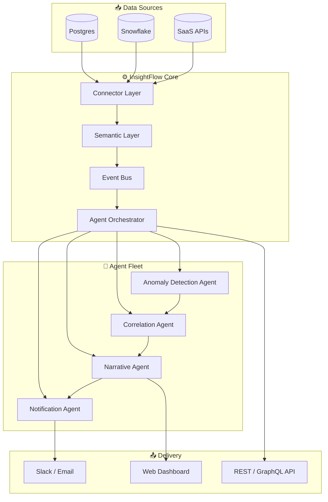
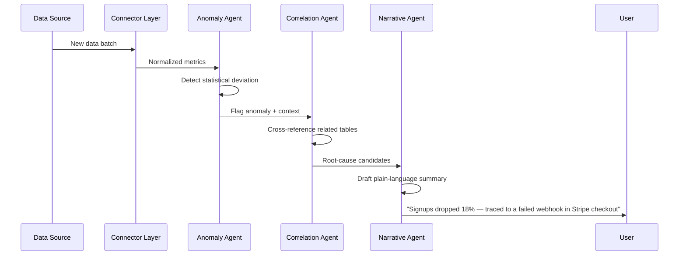

<div align="center">


# InsightFlow

### Turn raw data into decisions — automatically.

**InsightFlow** is an open-source agentic analytics engine that watches your data, reasons about what changed, and delivers plain-language insights before you even ask the question.


<br /> 

[](LICENSE)
[](https://github.com/insightflow-ai/insightflow/actions)
[](https://github.com/insightflow-ai/insightflow/releases)
[](https://github.com/insightflow-ai/insightflow/stargazers)
[](https://discord.gg/insightflow)
[](https://pypi.org/project/insightflow/)

<br />

[**Quick Start**](#-quick-start) · [**Docs**](https://docs.insightflow.dev) · [**Live Demo**](https://demo.insightflow.dev) · [**Architecture**](#-architecture) · [**Roadmap**](#-roadmap) · [**Discord**](https://discord.gg/insightflow)

</div>

<br />

> [!TIP]
> **Elevator pitch:** InsightFlow is what happens when you give a data analyst infinite time, zero fatigue, and access to every table in your warehouse. It's an agent, not a dashboard.

<br />

---

## 📖 Table of Contents

<details>
<summary>Click to expand</summary>

- [Why InsightFlow](#-why-insightflow)
- [Features](#-features)
- [Architecture](#-architecture)
- [Folder Structure](#-folder-structure)
- [Quick Start](#-quick-start)
- [Configuration](#-configuration)
- [Usage Examples](#-usage-examples)
- [Screenshots](#-screenshots)
- [Tech Stack](#-tech-stack)
- [Performance Goals](#-performance-goals)
- [Roadmap](#-roadmap)
- [Contributing](#-contributing)
- [Community & Governance](#-community--governance)
- [Support](#-support)
- [License](#-license)
- [Acknowledgements](#-acknowledgements)

</details>

<br />

## 💡 Why InsightFlow

### The Problem

> [!IMPORTANT]
> Modern teams generate more data than any human can watch. By the time someone thinks to build a dashboard for a metric, the anomaly that mattered has already passed.

Dashboards are passive. They wait for a human to open a tab, remember a filter, and notice a dip in a chart. That model breaks down the moment your data surface grows past a handful of key metrics — which, for any real company, happens in month one.

### The Solution

InsightFlow flips the model from **"pull"** to **"push."** A network of lightweight agents continuously watches your connected data sources, correlates changes across tables, and writes human-readable insight reports — delivered to Slack, email, or your own dashboard — *before anyone has to go looking.*

| | Traditional BI | InsightFlow |
|---|---|---|
| **Discovery** | You go find the insight | The insight finds you |
| **Interface** | Static charts | Natural-language agent |
| **Setup** | Weeks of dashboard building | Minutes of connector config |
| **Root cause** | Manual drill-down | Automatic correlation |
| **Scales with data** | Gets slower | Gets smarter |

### Our Mission

> To make institutional data understanding a background process, not a bottleneck.

### Our Vision

> A world where no decision is made on stale information, because every dataset has an agent watching it.

<br />

## ✨ Features

<table>
<tr>
<td width="50%" valign="top">

### 🧠 Autonomous Insight Agents
Long-running agents that monitor metrics, detect anomalies, and explain *why* — not just *what* — changed.

### 🔌 40+ Native Connectors
Postgres, Snowflake, BigQuery, Stripe, HubSpot, Google Analytics, and more, out of the box.

### 💬 Natural Language Interface
Ask "why did signups drop last Tuesday?" and get a cited, data-backed answer in seconds.

</td>
<td width="50%" valign="top">

### 📊 Auto-Generated Dashboards
Agents build and maintain dashboards for you as your schema evolves — no manual chart wiring.

### 🔁 Composable Agent Workflows
Chain detection → correlation → summarization → notification agents using a simple YAML DAG.

### 🔐 Bring-Your-Own-Model
Works with OpenAI, Anthropic, or self-hosted open-weight models via a single config flag.

</td>
</tr>
</table>

<br />

## 🏗 Architecture

InsightFlow is built as a set of cooperating agents around a shared event bus and a semantic layer that keeps every agent grounded in the same definition of "truth."



### Agent Workflow (Detection → Delivery)



<p align="center"></p>

<br />

## 📂 Folder Structure

```
insightflow/
├── .github/
│   ├── ISSUE_TEMPLATE/
│   │   ├── bug_report.yml
│   │   └── feature_request.yml
│   ├── workflows/
│   │   └── ci.yml
│   └── PULL_REQUEST_TEMPLATE.md
├── assets/
│   ├── banner.png
│   ├── logo.svg
│   ├── architecture.png
│   ├── workflow.png
│   ├── agents.png
│   ├── demo.gif
│   ├── dashboard-preview.png
│   ├── social-preview.png
│   ├── og-image.png
│   ├── favicon.ico
│   └── roadmap-illustration.png
├── packages/
│   ├── core/               # Orchestrator, event bus, semantic layer
│   ├── connectors/         # Source-specific data adapters
│   ├── agents/             # Detection, correlation, narrative, notification
│   └── sdk/                # Client SDKs (Python, TypeScript)
├── apps/
│   ├── dashboard/          # Web UI
│   └── docs/               # Documentation site
├── examples/
├── tests/
├── CONTRIBUTING.md
├── CODE_OF_CONDUCT.md
├── SECURITY.md
├── LICENSE
└── README.md
```

<br />

## 🚀 Quick Start

### Prerequisites

- Python ≥ 3.10 **or** Node.js ≥ 18
- Docker (recommended for local dev)
- An API key from OpenAI, Anthropic, or a self-hosted model endpoint

### Install

```bash
# via pip
pip install insightflow

# or via npm
npm install -g insightflow-cli

# or run the full stack with Docker
git clone https://github.com/insightflow-ai/insightflow.git
cd insightflow
docker compose up
```

### Initialize a project

```bash
insightflow init my-project
cd my-project
```

### Connect a data source

```bash
insightflow connect postgres \
  --host localhost \
  --database analytics \
  --user readonly_user
```

### Launch the agent fleet

```bash
insightflow run
```

```
✔ Connector "postgres" healthy
✔ Semantic layer built (42 tables, 318 metrics)
✔ Anomaly Agent watching 318 metrics
✔ Narrative Agent ready
→ InsightFlow is live at http://localhost:4200
```

<br />

## ⚙️ Configuration

InsightFlow is configured via `insightflow.config.yaml` at your project root.

```yaml
project: my-project

model:
  provider: anthropic          # openai | anthropic | local
  name: claude-sonnet-4-6

sources:
  - type: postgres
    name: warehouse
    schedule: "*/15 * * * *"   # every 15 minutes

agents:
  - anomaly_detection
  - correlation
  - narrative
  - notification

delivery:
  slack:
    webhook_url: ${SLACK_WEBHOOK_URL}
  dashboard:
    enabled: true
    port: 4200
```

### Environment Variables

| Variable | Required | Description |
|---|---|---|
| `INSIGHTFLOW_API_KEY` | ✅ | Your InsightFlow Cloud key (optional for self-hosted) |
| `ANTHROPIC_API_KEY` | ⚠️ conditional | Required if `model.provider: anthropic` |
| `OPENAI_API_KEY` | ⚠️ conditional | Required if `model.provider: openai` |
| `DATABASE_URL` | ✅ | Connection string for your primary data source |
| `SLACK_WEBHOOK_URL` | ❌ | Enables Slack delivery |
| `LOG_LEVEL` | ❌ | `debug` \| `info` \| `warn` \| `error` (default: `info`) |

<br />

## 🧪 Usage Examples

<details>
<summary><strong>Ask a question in natural language</strong></summary>

```bash
insightflow ask "Why did weekly active users drop last week?"
```

```
📉 WAU dropped 12.4% (2,481 → 2,173) between Jul 7–13.

Root cause candidates (ranked by confidence):
1. (81%) Mobile push notification job failed silently on Jul 9
2. (14%) Seasonal dip — matches -9% YoY pattern for this week
3. (5%)  No correlated marketing spend change detected

→ Recommended action: check `notifications_worker` logs for Jul 9.
```

</details>

<details>
<summary><strong>Define a custom agent workflow (YAML DAG)</strong></summary>

```yaml
workflow: churn_watch
trigger:
  schedule: "0 8 * * MON"
steps:
  - agent: anomaly_detection
    metric: churn_rate
  - agent: correlation
    sources: [support_tickets, billing_events]
  - agent: narrative
    tone: executive_summary
  - agent: notification
    channel: slack
    target: "#growth-team"
```

</details>

<details>
<summary><strong>Python SDK</strong></summary>

```python
from insightflow import Client

client = Client(api_key="...")

report = client.agents.narrative.summarize(
    metric="mrr",
    window="30d"
)

print(report.summary)
print(report.confidence)
```

</details>

<br />

## 🖼 Screenshots

<div align="center">


<p><em>Auto-generated dashboard — rebuilt automatically as your schema evolves</em></p>

<br />


<p><em>Live agent trace: anomaly detected → root cause → Slack delivery, in under 10 seconds</em></p>

</div>

<br />

## 🧰 Tech Stack

<div align="center">


</div>

| Layer | Choice | Why |
|---|---|---|
| Orchestration | Temporal-style durable workflows | Agents survive restarts and long-running jobs |
| Event Bus | Redis Streams | Low-latency fan-out to agent fleet |
| Semantic Layer | Custom (dbt-compatible) | One source of truth across all agents |
| Model Layer | Pluggable (Anthropic / OpenAI / local) | No vendor lock-in |
| Dashboard | Next.js + Recharts | Fast, server-rendered, themeable |

<br />

## 📈 Performance Goals

| Metric | Target |
|---|---|
| Anomaly detection latency | < 60s from data landing |
| Root-cause correlation | < 10s p95 |
| Narrative generation | < 5s p95 |
| Connector cold start | < 30s |
| Supported metrics per instance | 10,000+ |

<br />

## 🗺 Roadmap

<p align="center"></p>

- [x] Core agent orchestrator
- [x] Postgres, Snowflake, BigQuery connectors
- [x] Slack + email delivery
- [ ] Self-serve agent workflow builder (visual)
- [ ] Multi-tenant InsightFlow Cloud
- [ ] Fine-grained row-level access control
- [ ] Native Looker / Tableau embed
- [ ] On-device / fully local model support
- [ ] Agent marketplace (community-built agents)

> [!NOTE]
> Track live progress on the [public roadmap board](https://github.com/orgs/insightflow-ai/projects/1).

<br />

## 🤝 Contributing

We'd love your help. InsightFlow is built in the open, and every contribution — code, docs, issues, ideas — genuinely moves the roadmap.

```bash
git clone https://github.com/insightflow-ai/insightflow.git
cd insightflow
pnpm install
pnpm dev
```

1. Fork the repo and create your branch from `main`
2. Follow the code style (`pnpm lint` before committing)
3. Add tests for any new behavior
4. Open a PR using the provided template
5. One maintainer review + green CI required to merge

See [`CONTRIBUTING.md`](CONTRIBUTING.md) for the full guide, including our commit convention (Conventional Commits) and semantic versioning policy.

<br />

## 🏛 Community & Governance

| Resource | Purpose |
|---|---|
| [`CODE_OF_CONDUCT.md`](CODE_OF_CONDUCT.md) | Community standards (Contributor Covenant v2.1) |
| [`SECURITY.md`](SECURITY.md) | Responsible disclosure & supported versions |
| [GitHub Discussions](https://github.com/insightflow-ai/insightflow/discussions) | `Q&A` · `Ideas` · `Show & Tell` · `Announcements` |
| [Issue Labels](https://github.com/insightflow-ai/insightflow/labels) | `good-first-issue` · `help-wanted` · `agent` · `connector` · `docs` |
| Release strategy | `main` is always shippable; releases cut biweekly; SemVer (`MAJOR.MINOR.PATCH`) |

<br />

## 💬 Support

- 📚 [Documentation](https://docs.insightflow.dev)
- 💬 [Discord Community](https://discord.gg/insightflow)
- 🐛 [Report a Bug](https://github.com/insightflow-ai/insightflow/issues/new?template=bug_report.yml)
- ✉️ [contact@insightflow.dev](mailto:contact@insightflow.dev)

<br />

## 📊 Project Stats

<div align="center">


</div>

<br />

## 📄 License

InsightFlow is released under the [Apache License 2.0](LICENSE).

<br />

## 🙏 Acknowledgements

Built with gratitude on the shoulders of the open-source data and AI community — dbt, Redis, Next.js, and every contributor who has filed an issue, opened a PR, or simply given us a star.

<br />

---

<div align="center">


**InsightFlow** — *the insight finds you.*

[Website](https://insightflow.dev) · [Docs](https://docs.insightflow.dev) · [Twitter/X](https://twitter.com/insightflowai) · [LinkedIn](https://linkedin.com/company/insightflow) · [Discord](https://discord.gg/insightflow)

<sub>© 2026 InsightFlow. Made with care by the open-source community.</sub>

</div>
